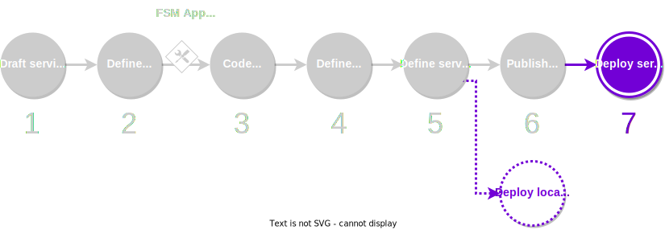

Deploying a service with the {{open_autonomy}} framework requires that you have a service configuration file available, which you could be a service created from scratch, fetched from the remote registry, or already registered in the on-chain protocol.

<figure markdown>

<figcaption>Part of the development process covered in this guide</figcaption>
</figure>

## What you will learn

This guide covers step 6 of the [development process](./overview_of_the_development_process.md). You will learn how to create and run deployments for local services (testing) and minted services.

You must ensure that your machine satisfies the framework requirements and that you have [set up the framework](./set_up.md#set-up-the-framework) and [a local registry with some default components](./set_up.md#set-up-the-local-registry-for-the-guides). As a result you should have a Pipenv workspace folder with a local registry (`./packages`) in it.

## Local deployment

This section covers the deployment of services being developed in the local registry. You can use such deployments to test your service before you mint it in the Autonolas Protocol.

1. **Fetch the service.** In the workspace folder, fetch the service from the local registry:
    <!-- TODO: packages lock + push all should not be necessary here, but otherwise it cannot build the image. -->
    ```bash
    autonomy packages lock
    autonomy push-all
    autonomy fetch your_name/your_service:0.1.0 --service --local
    ```

    This step is required to have a separate runtime folder (`./your_service`), outside of the local registry.

2. **Build the service agents' image.** Navigate to the service folder and build the Docker image of the service agents:

    ```bash
    cd your_service
    autonomy build-image #(1)!
    ```
    
    1. Check out the [`autonomy build-image`](../../advanced_reference/commands/autonomy_build-image) command documentation to learn more about its parameters and options.

    After the command finishes building the image, you can see that it has been created by executing:

    ```bash
    docker image ls | grep <service_agent_name>
    ```

3. **Prepare the keys file.** Prepare a JSON file `keys.json` containing the wallet address and the private key for each of the agents that make up the service.

    ???+ example "Example of a `keys.json` file"

        <span style="color:red">**WARNING: Use this file for testing purposes only. Never use the keys or addresses provided in this example in a production environment or for personal use.**</span>

        ```json
        [
          {
              "address": "0x15d34AAf54267DB7D7c367839AAf71A00a2C6A65",
              "private_key": "0x47e179ec197488593b187f80a00eb0da91f1b9d0b13f8733639f19c30a34926a"
          },
          {
              "address": "0x9965507D1a55bcC2695C58ba16FB37d819B0A4dc",
              "private_key": "0x8b3a350cf5c34c9194ca85829a2df0ec3153be0318b5e2d3348e872092edffba"
          },
          {
              "address": "0x976EA74026E726554dB657fA54763abd0C3a0aa9",
              "private_key": "0x92db14e403b83dfe3df233f83dfa3a0d7096f21ca9b0d6d6b8d88b2b4ec1564e"
          },
          {
              "address": "0x14dC79964da2C08b23698B3D3cc7Ca32193d9955",
              "private_key": "0x4bbbf85ce3377467afe5d46f804f221813b2bb87f24d81f60f1fcdbf7cbf4356"
          }
        ]
        ```

4. **Build the deployment.** Within the service folder, execute the command below to build the service deployment.

    ```bash
    rm -rf abci_build #(1)!
    autonomy deploy build keys.json -ltm #(2)!
    ```
   
    1. Delete previous deployments, if necessary.
    2. Check out the [`autonomy deploy build`](../../advanced_reference/commands/autonomy_deploy/#autonomy-deploy-build) command documentation to learn more about its parameters and options.

    This will create a deployment environment within the `./abci_build` folder with the following structure:

    ```bash
    abci_build/
    ├── agent_keys
    │   ├── agent_0
    │   ├── agent_1
    │   |   ...
    │   └── agent_N
    ├── nodes
    │   ├── node0
    │   ├── node1
    │   |   ...
    │   └── nodeN
    ├── persistent_data
    │   ├── benchmarks
    │   ├── logs
    │   ├── tm_state
    │   └── venvs
    └── docker-compose.yaml
    ```

5. **Run the service.** Navigate to the deployment environment folder (`./abci_build`) and run the deployment locally.

    ```bash
    cd abci_build
    autonomy deploy run #(1)!
    ```
    
    1. Check out the [`autonomy deploy run`](../../advanced_reference/commands/autonomy_deploy/#autonomy-deploy-run) command documentation to learn more about its parameters and options.

    This will spawn:
    
    * $N$ agents, each one running an instance of the {{fsm_app}}.
    * a network of $N$ Tendermint nodes, one per agent.

    The logs of a single agent or Tendermint node can be inspected in a separate terminal using `docker logs <container_id> --follow`.

    You can cancel the local execution at any time by pressing ++ctrl+c++.

## On-chain deployment

The {{open_autonomy}} framework provides a convenient interface for [services that are minted](./publish_mint_packages.md).

  1. **Find the service ID.** Explore the [services section](https://protocol.autonolas.network/agents) of the protocol frontend, and note the ID of the service that you want to deploy. The service must be in [Deployed state](https://docs.autonolas.network/protocol/life_cycle_of_a_service/#deployed).

  2. **Execute the service deployment.** Execute the following command

    ```bash
    autonomy deploy from-token <ID> keys.json --use-goerli
    ```
    where `keys.json` contains the addresses and keys of (some of) the registered agents in the service.

!!! warning "Important"
    When deploying a service registered on-chain, the framework automatically overrides a number of configuration arguments (under `setup`) in the agent containers with the values registered in the on-chain protocol:

    === "skill.yaml"

    ```yaml
    (...)
    models:
      params:
        args:
          setup:
            all_participants: # Overridden with the registered values
            safe_contract_address: # Overridden with the registered values
            consensus_threshold: # Overridden with the registered values
    ```

## Cloud deployment

!!! info
    This section will be added soon.
