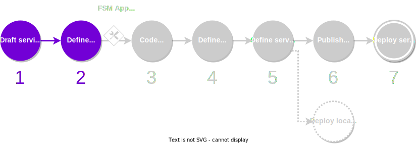

We will be covering the first two steps of the development process in this guide. We will use as an example the [Hello World service](../demos/hello_world_demo.md), where a set of 4 agents coordinate and take turns to print a "Hello World" message in their respective console.

<figure markdown>

<figcaption>Part of the development process covered in this guide</figcaption>
</figure>

## What you will learn

This guide covers steps 1 and 2 of the [development process](./overview_of_the_development_process.md). You will learn how to write the {{fsm_app}} specification that defines the main steps in the business logic of your service. The actual coding of the {{fsm_app}} will be covered in the next step.

## Draft the service idea

Define the business logic of your service as a [finite-state machine (FSM)](../key_concepts/fsm.md). That is, determine, at high-level, what are the states, events and transitions of the service:

* **States** define points where actions are executed (e.g., an agent sends a transaction on-chain).
* **Events** represent observed conditions (e.g., all agents have responded with a value, or an error has occurred).
* **Transitions** define how to move from one state to another based on the events observed (e.g., if the service observes an error event in a certain state, move back to the initial state).

???+ example "Example of a service FSM"
    This is an example of the FSM of the [Hello World service](../demos/hello_world_demo.md), at high level. You can learn more about the purpose of each of the states, events and transitions in its [dedicated section](../demos/hello_world_demo.md).

    <figure markdown>
    
    </figure>

!!! warning "Important"

    An important decision when designing your service is to determine what kind of agreement is required to transit from one state to another. For example:

    * Do agents have to collect and share a common value (e.g., a value observed from the same service provider) or a different value (e.g., each agent collects a value from a different service provider)?
    * Do all agents need to participate in the agreement to transit to another state, or it is enough that only a threshold of agents participate?.

## Define the FSM specification

In the workspace folder, define the `fsm_specification.yaml` file that formally encodes the FSM that you have designed in the previous step. This file must adhere to a syntax that is understood by the framework. The example below is self-explanatory.

???+ example "Example of an `fsm_specification.yaml` file"
    Given a draft of the FSM, the structure of the `fsm_specification.yaml` file is quite straightforward. Below we show the FSM specification file of the [Hello World service](../demos/hello_world_demo.md).

    ```yaml
    alphabet_in:
    - DONE
    - NO_MAJORITY
    - RESET_TIMEOUT
    - ROUND_TIMEOUT
    default_start_state: RegistrationRound
    final_states: []
    label: HelloWorldAbciApp
    start_states:
    - RegistrationRound
    states:
    - CollectRandomnessRound
    - PrintMessageRound
    - RegistrationRound
    - ResetAndPauseRound
    - SelectKeeperRound
    transition_func:
        (CollectRandomnessRound, DONE): SelectKeeperRound
        (CollectRandomnessRound, NO_MAJORITY): CollectRandomnessRound
        (CollectRandomnessRound, ROUND_TIMEOUT): CollectRandomnessRound
        (PrintMessageRound, DONE): ResetAndPauseRound
        (PrintMessageRound, ROUND_TIMEOUT): RegistrationRound
        (RegistrationRound, DONE): CollectRandomnessRound
        (ResetAndPauseRound, DONE): CollectRandomnessRound
        (ResetAndPauseRound, NO_MAJORITY): RegistrationRound
        (ResetAndPauseRound, RESET_TIMEOUT): RegistrationRound
        (SelectKeeperRound, DONE): PrintMessageRound
        (SelectKeeperRound, NO_MAJORITY): RegistrationRound
        (SelectKeeperRound, ROUND_TIMEOUT): RegistrationRound
    ```
