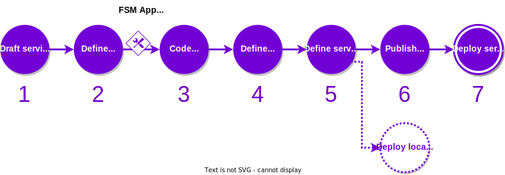

The figure below presents the development process with {{open_autonomy}}: from the idea of an off-chain service to its deployment in production. If you have completed the [quick start guide](../quick_start) you have already navigated through a significant part of this process.

<figure markdown>

<figcaption>Overview of the development process with the Open Autonomy framework</figcaption>
</figure>

This is a summary of each step:

1. **Draft the service idea.** Any service that needs to execute its functionality in an autonomous, transparent and decentralized way is a good candidate. You can take a look at some [use cases](../get_started/use_cases.md) to get an idea of what you can build with {{open_autonomy}}.

2. **Define the FSM specification.** Describe the service business logic as a [finite-state machine (FSM)](../key_concepts/fsm.md) in a language understood by the framework. This specification defines what are the states of the service, and how to transit from one to another.

3. **Code the {{fsm_app}} skill.** The actual business logic is encoded in the {{fsm_app}} that lives inside each agent. Coding the {{fsm_app}} involves scaffolding the "skeleton" of the classes, and complete the actual details of the actions executed in each state.

    !!! tip
        You can also use the [developer template repository](https://github.com/valory-xyz/dev-template) as the starting point. It includes some recommended linters, continuous integration and several other files so that you don't have to start from scratch.

        We recommend that your developed components have exhaustive tests and pass the library linters before publishing them to a remote registry.

4. **Define the agent.** Define the components of the agent required to execute your service, including the newly created {{fsm_app}}. You can reuse already existing components publicly available on a remote registry.

5. **Define the service.** This consists in defining the service configuration and declaring what agents constitute the service, together with a number of configuration parameters required.

6. **Mint the service (and other components) on-chain.** This is a required step to secure the the service developed in the [Autonolas Protocol](https://docs.autonolas.network/protocol/).

7. **Deploy the service.** You can deploy directly your service locally for testing purposes. To deploy a production service secured in the [Autonolas Protocol](https://docs.autonolas.network/protocol/) you first need to bring the service to the _Deployed_ state in the protocol.

In the next guides, we will explore the steps of this development process.

As you can see in the diagram above any developed component can be pushed/published to a remote registry, and minted in the on-chain registry. This mechanism allows that developers reuse components written by other developers, thus reducing the invested time in developing common functionalities.

