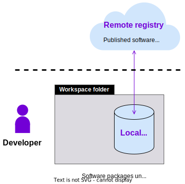

The purpose of this guide is to set up your system to work with the {{open_autonomy}} framework. All the remaining guides assume that you have followed these set up instructions.

## Requirements

Ensure that your machine satisfies the following requirements:

- [Python](https://www.python.org/) `>= 3.7` (recommended `>= 3.10`)
- [Pip](https://pip.pypa.io/en/stable/installation/)
- [Pipenv](https://pipenv.pypa.io/en/latest/installation/) `>=2021.x.xx`
- [Docker Engine](https://docs.docker.com/engine/install/)
- [Docker Compose](https://docs.docker.com/compose/install/)

## Set up the framework

1. Create a workspace folder:

    ```bash
    mkdir my_workspace
    cd my_workspace
    ```

2. Set up the environment. Remember to use the Python version you have installed. Here we are using 3.10 as reference:

    ```bash
    touch Pipfile && pipenv --python 3.10 && pipenv shell
    ```

3. Install the {{open_autonomy}} framework:

    ```bash
    pip install open-autonomy[all]
    ```

4. Initialize the framework to work with the remote [IPFS](https://ipfs.io) registry. This means that when the framework will be fetching a component, it will do so from the [IPFS](https://ipfs.io):

    ```bash
    autonomy init --remote --ipfs
    ```
    
    If you had previously initialized the framework, you need to use the flag `--reset` to change the configuration.

    !!! info
        The InterPlanetary File System ([IPFS](https://ipfs.io)) is a protocol, hypermedia and file sharing peer-to-peer network for storing and sharing data in a global, distributed file system. {{open_autonomy}} can use components stored in the [IPFS](https://ipfs.io), or stored locally.


## Set up the local registry

The framework works with the concept of *local* and *remote* registries to store software packages (similarly as Git repositories do). Existing (third-party) components are downloaded from the remote registry to the local registry, and developed components are pushed from the local registry to the remote registry, so that they become publicly available. 

<figure markdown>

</figure>

To create an empty local registry, execute within the workspace folder:

```bash
autonomy packages init
```

This will create an empty local registry in the folder `./packages`.

If you plan to follow the guides in the following sections, you need to populate the local registry with a number of default [packages shipped with the framework](../package_list.md). To do so, now execute:

```bash
cat > ./packages/packages.json << EOF
{
    "dev": {
    },
    "third_party": {
        "agent/valory/hello_world/0.1.0": "bafybeiep46qo633dbzvo7q55vtotteosjojgahofae4g4f3dzcdkv4f5cm",
        "connection/valory/abci/0.1.0": "bafybeib4ogh45setwh5ved653knyp7cvnafn54dkfaxmgufmypzbp6bvwy",
        "connection/valory/http_client/0.23.0": "bafybeidykl4elwbcjkqn32wt5h4h7tlpeqovrcq3c5bcplt6nhpznhgczi",
        "connection/valory/ipfs/0.1.0": "bafybeie46fu7mv64q72dwzoxg77zbiv3pzsigzjk3rehjpm47cf3y77mha",
        "connection/valory/ledger/0.19.0": "bafybeighon6i2qfl2xrg7t3lbdzlkyo4v2a7ayvwso7m5w7pf2hvjfs2ma",
        "connection/valory/p2p_libp2p_client/0.1.0": "bafybeidwcobzb7ut3efegoedad7jfckvt2n6prcmd4g7xnkm6hp6aafrva",
        "contract/valory/service_registry/0.1.0": "bafybeidiqury24wf7byjso5u4f7n4soa5xgcbo4iksegx3cvpa3bxlqm74",
        "protocol/open_aea/signing/1.0.0": "bafybeibqlfmikg5hk4phzak6gqzhpkt6akckx7xppbp53mvwt6r73h7tk4",
        "protocol/valory/abci/0.1.0": "bafybeig3dj5jhsowlvg3t73kgobf6xn4nka7rkttakdb2gwsg5bp7rt7q4",
        "protocol/valory/acn/1.1.0": "bafybeignmc5uh3vgpuckljcj2tgg7hdqyytkm6m5b6v6mxtazdcvubibva",
        "protocol/valory/contract_api/1.0.0": "bafybeidv6wxpjyb2sdyibnmmum45et4zcla6tl63bnol6ztyoqvpl4spmy",
        "protocol/valory/http/1.0.0": "bafybeifyoio7nlh5zzyn5yz7krkou56l22to3cwg7gw5v5o3vxwklibhty",
        "protocol/valory/ipfs/0.1.0": "bafybeihlgai5pbmkb6mjhvgy4gkql5uvpwvxbpdowczgz4ovxat6vajrq4",
        "protocol/valory/ledger_api/1.0.0": "bafybeidluywxchkacc7cz65nktqjg3y2vzzp43sw5hdhnvvonozogrmfie",
        "protocol/valory/tendermint/0.1.0": "bafybeicusvezoqlmyt6iqomcbwaz3xkhk2qf3d56q5zprmj3xdxfy64k54",
        "skill/valory/abstract_abci/0.1.0": "bafybeiebo5lfk7htzdarpfixqt4zedf7t6a57k6rejw7xqletcxbclmf4y",
        "skill/valory/abstract_round_abci/0.1.0": "bafybeiacsn3k7q5ytxg52enceluqgp3xbzb4raks5vlkvmeikqje4fkes4",
        "skill/valory/hello_world_abci/0.1.0": "bafybeibhlqvhup32mca6uvb6qy6sc3h4h44ek53eis3w5c2qilblfwn3qi"
    }
}
EOF
autonomy packages sync
```

The framework will fetch components from the remote registry and copy them into the local registry.

!!! info

    In the previous section, we used the command `autonomy init` to initialize the framework to fetch/push software packages from the remote registry by default (recommended option). You can override this decision for particular command through the flags `--registry-path` and `--local`, for example:

    ```bash
    autonomy --registry-path=<path_to_your_local_registry> <command> --local
    ```
